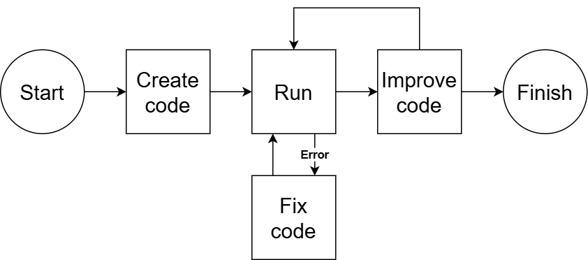

# AI-Data-Scientist


In this repogitory, we can try AI data scientist that behaves as a data scientist. Recently, LLM has been improved a lot, so we thought we could make LLM solve problems that data scientist handle usually.

<br></br>

## How to work
The flow of AI data scientist is as follows.



### 1. Create the code
Gemini api creates a code to solve a data science problem. Input prompt for gemini is as follows. `detail_web_link` is the link that explains a data science problem. `data_folder` is the folder that includes training data. `eval_score_path` is the file path that stores an evaluation score.

```python
original_objective = (
    "First, read this link: {0}. Also, create Python code to achieve the following goals in markdown format. "
    "The data is located at {1}. Save the best evaluation score as a JSON file in {2}, using the key 'eval_score' and the evaluation value as the value. "
    "Use a random seed of 42. For evaluation, split 80% of the data for training and 20% for validation. "
    "The file should be stored in the current directory without creating a new one.\n\n"
    "Problem Definition: Autonomously understand data science problems\n"
    "Data Exploration: Understand, preprocess, and visualize the data\n"
    "Feature Engineering: Create valid features\n"
    "Model Selection: Select a model and perform hyperparameter tuning based on the problem\n"
    "Evaluation and Improvement: Evaluate and improve model performance\n"
    "Reporting: Report results and present insights."
).format(detail_web_link, data_folder, eval_score_path)
```

Output of gemini api is written in markdown format, so we create a jupyter notebook from markdown format's string.

### 2. Run the code
After creating a jupyter notebook, we run it by using [nbformat](https://github.com/jupyter/nbformat).

### 3. Fix the code
If errors occur during running code, AI data scientist fix errors itself. We pass an error message and previous jupyter notebook path to gemini api, and re-create a jupyter notebook.

```python
response = model.generate_content(
    [
        "Fix the attached file and output the Python code as markdown."
        "The error message is: {0}. The original objective is: {1}".format(
            error_msg, original_objective
        ),
        output_file,
    ]
)
```

### 4. Improve the code
If error doesn't occur, we re-create a code to improve an evaluation score. Prompt for gemini api is as follows.

```python
response = model.generate_content(
    [
        "Read the attached Jupyter notebook and plan how to improve the evaluation score."
        "Then, implement Python code to improve the evaluation score in markdown format.\n"
        "The original objective is: {0}".format(original_objective),
        "executed_notebook_{0}.ipynb".format(i),
    ]
)
```

<br></br>

## How to run
You can create an environment with `requirements.txt`. We used python 3.10 to run a program.

We can configure information about AI data scientist by editting `config.yaml`. Items of configulation are as follows.

`api_key` is the api key of gemini, so specify your gemini api key. `train_data_path` is training dataset path that you want to try. `detail_web_link` is the link that includes information about task like kaggle competition link. `model_name` is the name of gemini model. `iter_num` is the number of running improvement loop. `retry_num` is the number of retry to fix errors.

```
- api_key
- train_data_path
- detail_web_link
- model_name
- iter_num
- retry_num
```

You can run AI data scientist by running the following command.

```bash
python3 main.py
```

<br></br>

## References
- [AI-Scientist](https://github.com/SakanaAI/AI-Scientist)
- [Titanic - Machine Learning from Disaster](https://www.kaggle.com/competitions/titanic)
- [New York City Taxi Trip Duration](https://www.kaggle.com/competitions/nyc-taxi-trip-duration)
- [nbformat](https://github.com/jupyter/nbformat)